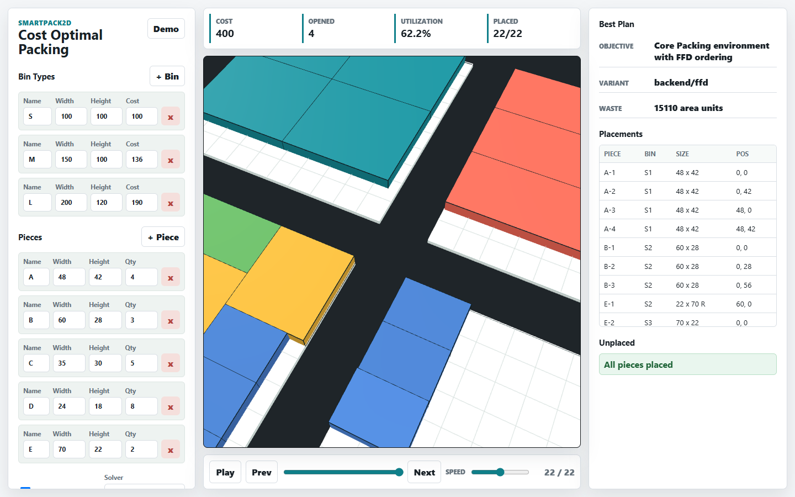

# SmartPack2D: Cost-Aware 2D Variable-Size Bin Packing with Deep Reinforcement Learning

SmartPack2D is a 2D Variable-Size Bin Packing (2DVSBPP) simulator and research prototype for cost-aware packing. It supports classical heuristic solving and trained Deep Reinforcement Learning agents through a Python backend and an interactive Three.js frontend.

The system can:

- Parse 2DVSBPP benchmark instances from the `2dvsbpp/` dataset.
- Train and evaluate PPO, A2C, Policy Gradient, and Q-learning agents.
- Run a Variable-Size First Fit Decreasing (FFD) baseline.
- Load `.pth` checkpoints for backend inference.
- Visualize packing layouts in a browser.
- Print model predictions for a single benchmark instance from the command line.

## SmartPack2D Screenshots

These screenshots are captured from the actual SmartPack2D web interface served by `server.py`.



## Visual References

The diagrams below are externally hosted references that make the 2D bin packing task easier to read at a glance: item sets, packed-bin output, remaining free rectangles, and neural/heuristic layout examples.

| Input parts and packed output | Maximal-rectangles free-space tracking |
| --- | --- |
| <br> |  |
| Source: [Stony Brook Algorithm Repository, Bin Packing](https://algorist.com/problems/Bin_Packing.html) | Source: [PLANETCALC, 2D Bin Packing Problem Solver](https://planetcalc.com/8634/) |

| Problem representation | Learned/heuristic packing layouts |
| --- | --- |
|  |  |
| Source: [Kaleta and Sliwinski, Electronics 2025, Figure 1](https://www.mdpi.com/2079-9292/14/10/1956) | Source: [Kaleta and Sliwinski, Electronics 2025, Figure 9](https://www.mdpi.com/2079-9292/14/10/1956) |

## Project Structure

```text
BinPacking/
├── agents/
│   ├── a2c_agent.py
│   ├── pg_agent.py
│   ├── ppo_agent.py
│   └── q_agent.py
├── env/
│   └── packing_env.py
├── frontend/
│   ├── index.html
│   ├── app.js
│   └── styles.css
├── scripts/
│   ├── train_policy_gradient.py
│   ├── train_a2c.py
│   ├── train_ppo.py
│   ├── train_qlearning.py
│   ├── evaluate_batch.py
│   └── predict_instance.py
├── utils/
│   ├── amp.py
│   ├── data.py
│   ├── device.py
│   ├── heuristics.py
│   ├── io.py
│   └── metrics.py
├── 2dvsbpp/
├── server.py
└── README.md
```

## Requirements

Recommended:

- Python 3.10+
- CUDA-capable GPU for neural training and fast inference
- Docker is not required
- Node.js is optional, only useful for checking frontend JavaScript syntax

Python packages:

```bash
pip install torch numpy pandas matplotlib
```

For GPU training, install the PyTorch build that matches your CUDA version from the official PyTorch install selector:

```text
https://pytorch.org/get-started/locally/
```

The frontend imports Three.js from a CDN, so browser access to the internet is needed unless the dependency is vendored locally.

## Setup

Clone the repository:

```bash
git clone https://github.com/Luchienlanh/SmartPack2D-Cost-Optimal-2D-Variable-Size-Bin-Packing-via-Deep-Reinforcement-Learning.git
cd SmartPack2D-Cost-Optimal-2D-Variable-Size-Bin-Packing-via-Deep-Reinforcement-Learning
```

Create and activate a virtual environment.

Windows PowerShell:

```powershell
python -m venv .venv
.\.venv\Scripts\Activate.ps1
pip install torch numpy pandas matplotlib
```

Linux/macOS:

```bash
python -m venv .venv
source .venv/bin/activate
pip install torch numpy pandas matplotlib
```

Check device availability:

```bash
python -c "import torch; print(torch.cuda.is_available()); print(torch.cuda.get_device_name(0) if torch.cuda.is_available() else 'CPU')"
```

## Dataset

The repository expects benchmark files under:

```text
2dvsbpp/
```

Each `.txt` file is parsed as a 2DVSBPP instance. The loader strips the unused `Z` dimension and stores items as `(height, width)` internally.

Dataset scanning is handled by:

```python
utils.data.scan_dataset_limits()
```

The current model limits used by the backend are:

```text
max width:     300
max height:    300
max items:     200
max bin types: 5
```

## Running the Backend and Frontend

Start the backend server:

```bash
python server.py --host 127.0.0.1 --port 8000
```

Open the frontend:

```text
http://127.0.0.1:8000
```

Do not open `frontend/index.html` directly. The browser frontend calls the backend endpoint `/api/pack`, and checkpoint inference only works through `server.py`.

Health check:

```bash
curl http://127.0.0.1:8000/api/health
```

Expected shape:

```json
{
  "ok": true,
  "device": "cuda",
  "models": {
    "ppo": true,
    "a2c": true,
    "pg": true
  }
}
```

## Frontend Solvers

The frontend only sends the problem definition to the backend and renders the returned packing result. It does not run a JavaScript packing solver.

Available solver modes:

- `Core FFD`: Python FFD heuristic baseline
- `PPO model`: loads `ppo_model.pth`
- `A2C model`: loads `a2c_train.pth`
- `Policy Gradient`: loads `train_plc.pth`

The expected checkpoint files are:

```text
ppo_model.pth
a2c_train.pth
train_plc.pth
```

## Allow Rotation

`Allow rotation` permits a piece to be placed after a 90-degree rotation.

Example:

```text
original: width=60, height=28
rotated:  width=28, height=60
```

When rotation is enabled, the backend evaluates both:

1. rotation-enabled inference
2. no-rotation inference

It returns the better result by objective order:

```text
fewer unplaced pieces -> lower cost -> fewer bins -> lower waste -> higher utilization
```

This prevents an enabled rotation action space from returning a worse solution than the no-rotation candidate for the same input.

## Training

Training scripts are in `scripts/`.

Policy Gradient:

```bash
python scripts/train_policy_gradient.py
```

A2C:

```bash
python scripts/train_a2c.py
```

PPO:

```bash
python scripts/train_ppo.py
```

Q-learning:

```bash
python scripts/train_qlearning.py
```

Recommended training order:

```text
Policy Gradient -> A2C -> PPO
```

Q-learning is included for experimentation, but it uses a Q-table and can consume large CPU memory on grid states.

Current training defaults:

```text
Policy Gradient: 100 episodes, batch_size=16, checkpoint=train_plc.pth
A2C:             100 episodes, batch_size=8,  checkpoint=a2c_train.pth
PPO:             100 episodes, batch_size=8,  checkpoint=ppo_model.pth
Q-learning:       50 episodes, checkpoint=ql_train.pth
```

The neural agents use automatic mixed precision (AMP) on CUDA through `utils/amp.py`.

To restart training from scratch, delete old checkpoints first.

Windows PowerShell:

```powershell
Remove-Item .\train_plc.pth, .\a2c_train.pth, .\ppo_model.pth -ErrorAction SilentlyContinue
```

Linux/macOS:

```bash
rm -f train_plc.pth a2c_train.pth ppo_model.pth
```

## Batch Evaluation

Run:

```bash
python scripts/evaluate_batch.py
```

The evaluator compares:

- FFD heuristic
- PPO checkpoint, if `ppo_model.pth` exists
- A2C checkpoint, if `a2c_train.pth` exists
- Policy Gradient checkpoint, if `train_plc.pth` exists

Metrics:

- average cost
- average bins opened
- average space utilization
- placement success rate
- average runtime

## Predicting a Single Instance

Use `scripts/predict_instance.py` to print model predictions for one benchmark file.

PPO:

```bash
python scripts/predict_instance.py --agent ppo --instance 2dvsbpp/MB_MC_4_100_100_10.txt
```

A2C:

```bash
python scripts/predict_instance.py --agent a2c --checkpoint a2c_train.pth --instance 2dvsbpp/MB_MC_4_100_100_10.txt
```

Policy Gradient:

```bash
python scripts/predict_instance.py --agent pg --checkpoint train_plc.pth --instance 2dvsbpp/MB_MC_4_100_100_10.txt
```

Print JSON:

```bash
python scripts/predict_instance.py --agent ppo --instance 2dvsbpp/MB_MC_4_100_100_10.txt --json
```

Render with Matplotlib:

```bash
python scripts/predict_instance.py --agent ppo --instance 2dvsbpp/MB_MC_4_100_100_10.txt --render
```

Show every chosen action:

```bash
python scripts/predict_instance.py --agent ppo --instance 2dvsbpp/MB_MC_4_100_100_10.txt --show-actions
```

## API Usage

Endpoint:

```text
POST /api/pack
```

Example request body:

```json
{
  "solver": "ppo",
  "allowRotation": true,
  "bins": [
    { "name": "S", "width": 100, "height": 100, "cost": 100 },
    { "name": "M", "width": 150, "height": 100, "cost": 136 }
  ],
  "pieces": [
    { "name": "A", "width": 48, "height": 42, "qty": 4 },
    { "name": "B", "width": 60, "height": 28, "qty": 3 }
  ]
}
```

Supported `solver` values:

```text
ffd
ppo
a2c
pg
policy_gradient
```

The response contains:

- `bins`
- `placements`
- `unplaced`
- `totalCost`
- `utilization`
- `waste`
- `variant`
- `notes`

## Running on Kaggle

Copy the project into `/kaggle/working`, then run:

```bash
%cd /kaggle/working/BinPacking

!python -c "import torch; print(torch.cuda.is_available()); print(torch.cuda.get_device_name(0) if torch.cuda.is_available() else 'CPU')"

!PYTORCH_CUDA_ALLOC_CONF=expandable_segments:True python scripts/train_policy_gradient.py
!PYTORCH_CUDA_ALLOC_CONF=expandable_segments:True python scripts/train_a2c.py
!PYTORCH_CUDA_ALLOC_CONF=expandable_segments:True python scripts/train_ppo.py
```

Save checkpoints to Kaggle output:

```bash
!mkdir -p /kaggle/working/checkpoints
!cp *.pth /kaggle/working/checkpoints/ || true
```

## Troubleshooting

### Frontend does not load model results

Use:

```bash
python server.py --host 127.0.0.1 --port 8000
```

Then open:

```text
http://127.0.0.1:8000
```

Do not open `frontend/index.html` directly.

### Checkpoints not found

The backend expects:

```text
ppo_model.pth
a2c_train.pth
train_plc.pth
```

Place them in the project root.

### CUDA out of memory

The project already uses AMP and smaller default batch sizes. If OOM still occurs:

- reduce `batch_size` in the training script
- train one model per session
- restart the Python process before training a different model
- use `PYTORCH_CUDA_ALLOC_CONF=expandable_segments:True`

### Shape mismatch when loading checkpoint

Delete old checkpoints and retrain. Architecture changes such as adaptive pooling can make older checkpoint shapes incompatible.

### Some items remain unplaced

Possible causes:

- item is too large for every available bin
- model reaches the safety step limit
- no valid placement exists under the current rotation setting

For frontend inference, the backend opens new bins when no valid placement remains in the active bin.

## Notes

- The browser frontend does not execute model inference directly.
- All `.pth` checkpoints are loaded by the Python backend.
- FFD is a heuristic baseline, not a trained model.
- PPO/A2C/Policy Gradient inference is greedy and deterministic.
- Rotation-enabled inference compares against a no-rotation candidate and returns the better objective.

## Technologies

- Python
- PyTorch
- NumPy
- Pandas
- Matplotlib
- JavaScript
- Three.js
- HTML/CSS
